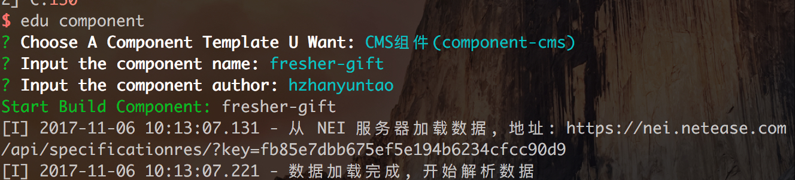

# edu-cli 
## 教育产品CLI工具

### 功能
- 方便的生成新的组件模板

托管在[ykt-front/edu-cli](https://g.hz.netease.com/ykt-front/edu-cli),以后如果有更多功能需要，可以自行开发

### 安装
1. ```npm install -g edu-cli```，会自动拉下配置文件（~/.edu），最好不要使用```sudo```安装

2. ```edu component```,交互式输入组件有关信息，调用nei生成组件

    

3. ```edu component -k [conponentKey]```，直接设置nei工程规范的key，跳过交互式命令的第一步。用于集成到package.json的scripts中，如对于component-cms,可以设置：

    ```json
    //package.json

    //...
    "scripts": {
        "component" : "edu component -k fb85e7dbb675ef5e194b6234cfcc90d9"
    }
    //...
    ```
    在component-cms目录下：
    ```shell
    npm run component
```

4. ```edu update```更新配置

### 配置文件

见 [配置说明](./doc/config.md)